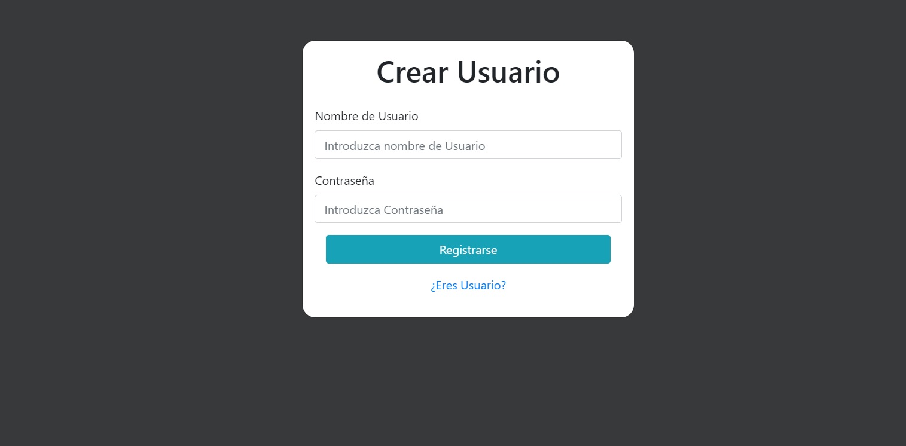

# OptiManager #
## Descripción de OpticManager ##

Programa de gestión para ópticas.

Tendrá acceso el personal de tienda a través de un login, en el cuál podrán crear, eliminar, editar a los clientes
y material de tienda (gafas, lentes, lentes de contácto, líquidos, etc). 

He pensado que puede ser una aplicación bastante útil y que puede ser utilizada desde una tablet, para poder registrar de manera más rápida a nuestros clientes cuando entren en la óptica y así perder el menor tiempo posible entre ellos.
Las cuentas de usuario que podemos utilizar para probar a la aplicación son:
```
Usuario: Optica | contraseña: 1234
Usuario: Miguel | contraseña: 1234
```
El usuario "Optica" lo vamos a encontrar con datos introducidos, mientras que el usuario "Miguel" está completamente vacío.

En esta aplicación no vamos a encontrar un administrador, directamente creamos un usuario y este usuario se va a encargar de realizar todas las acciones de dicha óptica. 

## Base de datos de la Aplicación ##


Base de datos con relaciones 1:N en la cuál nos podemos encontrar con 3 tablas. Tabla _optica_(usuarios), tabla _cliente_ (clientes que vamos agregando a la óptica) y por último la tabla _producto_ (almacenará los productos de la óptica).

En todas ellas, la PK va a ir incrementandose, es decir, si añadimos un primer cliente, ese cliente tendrá el código nº1 y así de manera creciente cada vez que añadimos uno nuevo (nunca se van a repetir).

Tanto la tabla _cliente_ como la de _producto_ están relacionadas con la de _optica_ para que cada vez que iniciemos la sesión con usuarios diferentes, no nos aparezcan los mismos clientes en cada uno de ellos.

## Página Principal y Login ##


Lo primero que no vamos a encontrar al iniciar la aplicación, es una página de inicio bastante sencilla, en la que nos permite directamente a través de un formulario introducir los datos de usuario y contraseña para _Acceder_ a la aplicación. Encontraremos también con letra azul y subrayada para poder clickear _Crear Cuenta_.

## Crear Cuenta / Registro ##



La ventana a la que nos redirige si pulsamos en_Crear Cuenta_, es un formulario en el que nos pedirá un Nombre de Usuario y una Contraseña. También nos aparece un _¿Eres usuario?_ para en el caso de que ya tengamos cuenta, podamos volver atrás.

Tras hacer click en _Registrarse_, se habrá creado un nuevo usuario en la base de datos, por lo tanto, volveríamos a la pantalla inicial y introduciríamos los datos del nuevo usuario.

## Menú ##


Tras acceder a la aplicación con un usuario y contraseña, nos redirigirá a un menú en el que aparecerán dos botones para seleccionar, uno el botón de _**Listado Clientes**_ y otro botón con _**Listado Productos**_. Más abajo nos aparece en letras azul y subrayado para cerrar la sesión del usuario con el que hemos iniciado.

En la parte de arriba del menú, también nos aparece un mensaje de _"HAS INICIADO SESIÓN CON + Nombre Usuario"_ para saber con la cuenta que hemos accedido o en la cuenta que estamos.

## Listados Clientes / Productos ##

   

Al hacer click en cualquiera de los dos botones del menú, nos redirigirá a una ventana en la que nos aparecerá un listado completo con todos los productos y clientes que hayamos agregado (en el caso de que seamos usuario nuevo, la lista estará vacía). 

En ambas listas, nos vamos a encontrar con dos botones en la parte superior derecha en la que uno de ellos es para _"+ Añadir Cliente / + Añadir Producto_ y en el otro para _"Volver al menú"_.

Si tenemos clientes y productos introducidos, nos aparecerá en el apartado acciones un botón con un lápiz para poder editar dicho cliente o producto y en el otro una papelera para poder borrarlos.

## Añadir / Editar ##

Tanto la ventana añadir como editar, son completamente iguales aunque cada una de ellas tiene su función.
En la 
